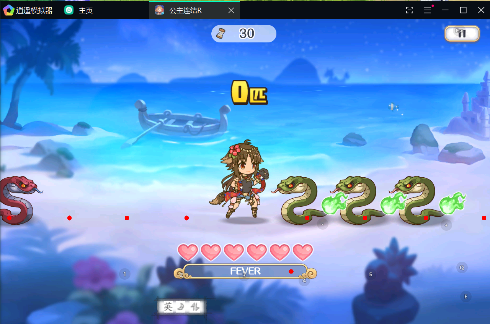

# 公主连结水狗活动自动脚本
## 使用方法
1. 安装以下库
```bash
pip install opencv
pip install pyautogui
pip install pillow
```
2. 修改 config.py 的坐标
3. 运行 test.py 里的 show_game()

确保 八个蛇的判定点在蛇的尾部, fever在最后一段, 左键右键点击位置准确
4. 运行 pcr.py!
## 演示地址
[b站](https://www.bilibili.com/video/BV1rb4y1z7qw)